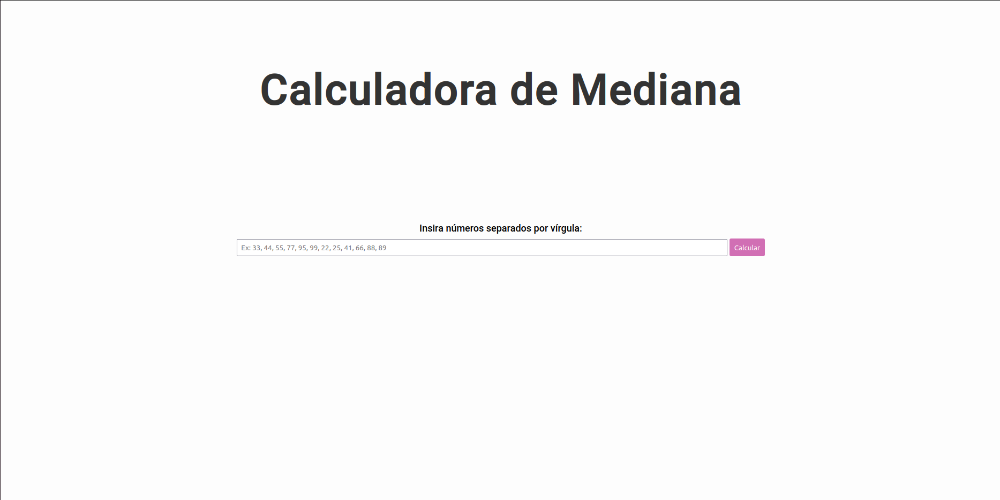
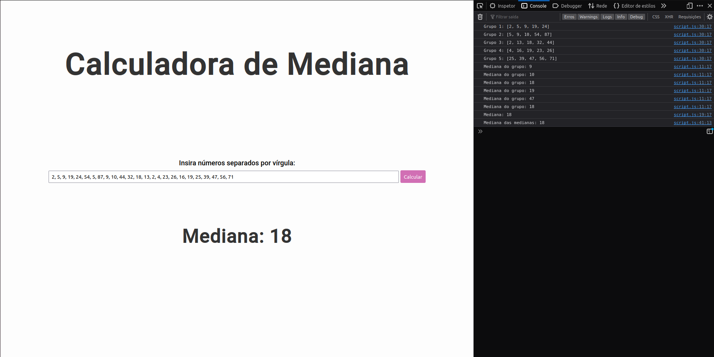

# Calculadora de Medianas

**Conteúdo da Disciplina**: Dividir e Conquistar<br>

## Alunos

| Matrícula |                        Aluno                        |
| :-------: | :-------------------------------------------------: |
| 190025581 | [Bruno Oliveira Lima](https://github.com/eng-Bruno) |
| --------- |                        ----------                   |

## Sobre

Calculadora de Medianas que utiliza o algoritmo de Mediana das Medianas para realizar o cálculo.

## Screenshots




## Instalação

**Linguagem**:JavaScript<br>

## Como Rodar

Clonar o repositório do projeto:

```
git clone https://github.com/projeto-de-algoritmos/D-C_CalculadoraMediana

```

Após clonar o repositório localmente, abrir o arquivo index.html no navegador.

## Apresentação

[Calculadora de Mediana - Dividir e Conquistar](./apresentação/Calculadora%20de%20Mediana.zip)


